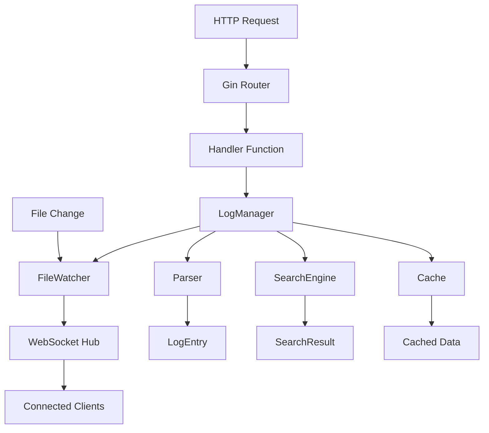

# 开发者指南

本指南面向希望贡献代码、扩展功能或深入了解本地日志查看工具内部实现的开发者。

## 目录

- [开发环境设置](#开发环境设置)
- [项目架构](#项目架构)
- [代码规范](#代码规范)
- [测试指南](#测试指南)
- [构建和发布](#构建和发布)
- [贡献指南](#贡献指南)

## 开发环境设置

### 系统要求

- **Go**: 1.21 或更高版本
- **Node.js**: 18.0 或更高版本
- **npm**: 9.0 或更高版本
- **Git**: 2.30 或更高版本

### 克隆项目

```bash
git clone https://github.com/your-org/logviewer.git
cd logviewer
```

### 安装依赖

#### 后端依赖

```bash
# 下载 Go 模块
go mod download

# 验证依赖
go mod verify
```

#### 前端依赖

```bash
cd frontend
npm install
cd ..
```

### 开发工具

推荐安装以下开发工具：

```bash
# Go 工具
go install golang.org/x/tools/cmd/goimports@latest
go install github.com/golangci/golangci-lint/cmd/golangci-lint@latest
go install github.com/swaggo/swag/cmd/swag@latest

# 前端工具
npm install -g @vue/cli
npm install -g typescript
```

### IDE 配置

#### VS Code

推荐扩展：
- Go (Google)
- Vue Language Features (Volar)
- TypeScript Vue Plugin (Volar)
- ESLint
- Prettier

配置文件 `.vscode/settings.json`：
```json
{
  "go.useLanguageServer": true,
  "go.formatTool": "goimports",
  "go.lintTool": "golangci-lint",
  "editor.formatOnSave": true,
  "editor.codeActionsOnSave": {
    "source.organizeImports": true
  }
}
```

## 项目架构

### 目录结构

```
logviewer/
├── cmd/                    # 应用程序入口点
│   └── logviewer/
│       └── main.go
├── internal/               # 内部包（不对外暴露）
│   ├── config/            # 配置管理
│   ├── server/            # HTTP 服务器
│   ├── manager/           # 日志管理器
│   ├── parser/            # 日志解析器
│   ├── search/            # 搜索引擎
│   ├── watcher/           # 文件监控
│   ├── cache/             # 缓存系统
│   ├── types/             # 数据类型定义
│   └── interfaces/        # 接口定义
├── pkg/                   # 公共库（可对外暴露）
├── frontend/              # 前端代码
│   ├── src/
│   │   ├── components/    # Vue 组件
│   │   ├── views/         # 页面视图
│   │   ├── services/      # API 服务
│   │   └── stores/        # 状态管理
│   └── public/
├── web/                   # 构建后的前端资源
├── docs/                  # 文档
├── scripts/               # 构建脚本
├── e2e/                   # 端到端测试
└── testdata/              # 测试数据
```

### 核心组件

#### 1. HTTP 服务器 (internal/server)

负责处理 HTTP 请求和 WebSocket 连接：

```go
type HTTPServer struct {
    router     *gin.Engine
    config     *config.Config
    logManager *manager.LogManager
    wsHub      *WebSocketHub
}
```

主要功能：
- REST API 路由处理
- 静态文件服务
- WebSocket 连接管理
- 中间件集成

#### 2. 日志管理器 (internal/manager)

核心业务逻辑，管理日志文件的读取和索引：

```go
type LogManager struct {
    config      *config.Config
    fileWatcher *watcher.FileWatcher
    parsers     map[string]parser.LogParser
    cache       *cache.Cache
    searchEngine *search.Engine
}
```

主要功能：
- 文件扫描和索引
- 日志内容读取
- 解析器管理
- 缓存协调

#### 3. 日志解析器 (internal/parser)

支持多种日志格式的解析：

```go
type LogParser interface {
    Parse(line string) (*types.LogEntry, error)
    CanParse(content string) bool
    GetFormat() string
}
```

实现的解析器：
- `JSONLogParser`: JSON 格式日志
- `CommonLogParser`: 通用格式日志
- `ApacheLogParser`: Apache 访问日志
- `NginxLogParser`: Nginx 访问日志

#### 4. 搜索引擎 (internal/search)

提供强大的搜索和过滤功能：

```go
type Engine struct {
    indexer    *Indexer
    matcher    *Matcher
    filters    []Filter
}
```

支持的搜索类型：
- 关键词搜索
- 正则表达式搜索
- 时间范围过滤
- 日志级别过滤

#### 5. 文件监控 (internal/watcher)

实时监控文件系统变化：

```go
type FileWatcher struct {
    watcher   *fsnotify.Watcher
    callbacks map[string][]WatchCallback
    mu        sync.RWMutex
}
```

功能特性：
- 跨平台文件监控
- 事件去重和合并
- 回调函数管理

### 数据流



## 代码规范

### Go 代码规范

#### 1. 命名规范

```go
// 包名：小写，简短，有意义
package parser

// 接口名：通常以 -er 结尾
type LogParser interface {}

// 结构体：驼峰命名
type LogManager struct {}

// 方法名：驼峰命名，公开方法首字母大写
func (lm *LogManager) GetLogFiles() []LogFile {}

// 私有方法首字母小写
func (lm *LogManager) parseLogFile() error {}

// 常量：全大写，下划线分隔
const MAX_FILE_SIZE = 1024 * 1024 * 1024
```

#### 2. 错误处理

```go
// 使用自定义错误类型
type LogError struct {
    Code    string
    Message string
    Cause   error
}

func (e *LogError) Error() string {
    return fmt.Sprintf("%s: %s", e.Code, e.Message)
}

// 错误包装
func readLogFile(path string) error {
    file, err := os.Open(path)
    if err != nil {
        return &LogError{
            Code:    "FILE_NOT_FOUND",
            Message: fmt.Sprintf("cannot open file: %s", path),
            Cause:   err,
        }
    }
    defer file.Close()
    
    // ... 处理逻辑
    return nil
}
```

#### 3. 并发安全

```go
// 使用互斥锁保护共享资源
type SafeCache struct {
    mu    sync.RWMutex
    items map[string]interface{}
}

func (c *SafeCache) Get(key string) (interface{}, bool) {
    c.mu.RLock()
    defer c.mu.RUnlock()
    
    value, exists := c.items[key]
    return value, exists
}

func (c *SafeCache) Set(key string, value interface{}) {
    c.mu.Lock()
    defer c.mu.Unlock()
    
    c.items[key] = value
}
```

#### 4. 上下文使用

```go
// 在长时间运行的操作中使用 context
func (lm *LogManager) SearchLogs(ctx context.Context, query SearchQuery) (*SearchResult, error) {
    select {
    case <-ctx.Done():
        return nil, ctx.Err()
    default:
    }
    
    // 执行搜索逻辑
    result, err := lm.searchEngine.Search(ctx, query)
    if err != nil {
        return nil, err
    }
    
    return result, nil
}
```

### TypeScript/Vue 代码规范

#### 1. 组件结构

```vue
<template>
  <div class="log-viewer">
    <!-- 模板内容 -->
  </div>
</template>

<script setup lang="ts">
import { ref, computed, onMounted } from 'vue'
import type { LogEntry, SearchQuery } from '@/types'

// Props 定义
interface Props {
  logPath: string
  autoRefresh?: boolean
}

const props = withDefaults(defineProps<Props>(), {
  autoRefresh: true
})

// 响应式数据
const logEntries = ref<LogEntry[]>([])
const isLoading = ref(false)

// 计算属性
const filteredEntries = computed(() => {
  return logEntries.value.filter(entry => entry.level === 'ERROR')
})

// 方法
const loadLogs = async () => {
  isLoading.value = true
  try {
    // 加载逻辑
  } catch (error) {
    console.error('Failed to load logs:', error)
  } finally {
    isLoading.value = false
  }
}

// 生命周期
onMounted(() => {
  loadLogs()
})
</script>

<style scoped>
.log-viewer {
  /* 样式定义 */
}
</style>
```

#### 2. 类型定义

```typescript
// types/index.ts
export interface LogEntry {
  timestamp: Date
  level: LogLevel
  message: string
  fields: Record<string, unknown>
  raw: string
  lineNum: number
}

export type LogLevel = 'DEBUG' | 'INFO' | 'WARN' | 'ERROR'

export interface SearchQuery {
  path: string
  query: string
  isRegex: boolean
  startTime?: Date
  endTime?: Date
  levels: LogLevel[]
}
```

#### 3. API 服务

```typescript
// services/api.ts
import type { LogEntry, SearchQuery, SearchResult } from '@/types'

class ApiService {
  private baseURL = '/api'

  async getLogFiles(): Promise<LogFile[]> {
    const response = await fetch(`${this.baseURL}/logs`)
    if (!response.ok) {
      throw new Error(`HTTP error! status: ${response.status}`)
    }
    return response.json()
  }

  async searchLogs(query: SearchQuery): Promise<SearchResult> {
    const params = new URLSearchParams({
      path: query.path,
      query: query.query,
      isRegex: query.isRegex.toString(),
      levels: query.levels.join(',')
    })

    if (query.startTime) {
      params.set('startTime', query.startTime.toISOString())
    }

    const response = await fetch(`${this.baseURL}/search?${params}`)
    if (!response.ok) {
      throw new Error(`Search failed: ${response.statusText}`)
    }
    
    return response.json()
  }
}

export const apiService = new ApiService()
```

## 测试指南

### 单元测试

#### Go 测试

```go
// internal/parser/json_test.go
package parser

import (
    "testing"
    "time"
    
    "github.com/stretchr/testify/assert"
    "github.com/stretchr/testify/require"
)

func TestJSONLogParser_Parse(t *testing.T) {
    parser := NewJSONLogParser()
    
    tests := []struct {
        name     string
        input    string
        expected *types.LogEntry
        wantErr  bool
    }{
        {
            name:  "valid JSON log",
            input: `{"timestamp":"2024-01-01T10:00:00Z","level":"info","message":"test"}`,
            expected: &types.LogEntry{
                Timestamp: time.Date(2024, 1, 1, 10, 0, 0, 0, time.UTC),
                Level:     "info",
                Message:   "test",
            },
            wantErr: false,
        },
        {
            name:    "invalid JSON",
            input:   `{invalid json}`,
            wantErr: true,
        },
    }
    
    for _, tt := range tests {
        t.Run(tt.name, func(t *testing.T) {
            result, err := parser.Parse(tt.input)
            
            if tt.wantErr {
                assert.Error(t, err)
                return
            }
            
            require.NoError(t, err)
            assert.Equal(t, tt.expected.Level, result.Level)
            assert.Equal(t, tt.expected.Message, result.Message)
        })
    }
}
```

#### Vue 测试

```typescript
// frontend/src/components/__tests__/LogViewer.spec.ts
import { describe, it, expect, vi } from 'vitest'
import { mount } from '@vue/test-utils'
import LogViewer from '../LogViewer.vue'
import type { LogEntry } from '@/types'

describe('LogViewer', () => {
  const mockLogEntries: LogEntry[] = [
    {
      timestamp: new Date('2024-01-01T10:00:00Z'),
      level: 'INFO',
      message: 'Test message',
      fields: {},
      raw: '2024-01-01 10:00:00 INFO Test message',
      lineNum: 1
    }
  ]

  it('renders log entries correctly', () => {
    const wrapper = mount(LogViewer, {
      props: {
        logPath: 'test.log',
        entries: mockLogEntries
      }
    })

    expect(wrapper.find('.log-entry').exists()).toBe(true)
    expect(wrapper.text()).toContain('Test message')
  })

  it('emits search event when search is triggered', async () => {
    const wrapper = mount(LogViewer, {
      props: {
        logPath: 'test.log',
        entries: []
      }
    })

    await wrapper.find('.search-input').setValue('error')
    await wrapper.find('.search-button').trigger('click')

    expect(wrapper.emitted('search')).toBeTruthy()
    expect(wrapper.emitted('search')?.[0]).toEqual(['error'])
  })
})
```

### 集成测试

```go
// internal/manager/integration_test.go
func TestLogManager_Integration(t *testing.T) {
    // 设置测试环境
    tempDir := setupTestEnvironment(t)
    defer os.RemoveAll(tempDir)
    
    config := &config.Config{
        Server: config.ServerConfig{
            LogPaths: []string{tempDir},
        },
    }
    
    manager := manager.NewLogManager(config)
    
    t.Run("file scanning", func(t *testing.T) {
        files, err := manager.GetLogFiles()
        require.NoError(t, err)
        assert.Greater(t, len(files), 0)
    })
    
    t.Run("log reading", func(t *testing.T) {
        content, err := manager.ReadLogFile("test.log", 0, 10)
        require.NoError(t, err)
        assert.Equal(t, 10, len(content.Entries))
    })
}
```

### 运行测试

```bash
# 运行所有 Go 测试
go test ./...

# 运行特定包的测试
go test ./internal/parser -v

# 运行测试并生成覆盖率报告
go test ./... -coverprofile=coverage.out
go tool cover -html=coverage.out

# 运行前端测试
cd frontend
npm run test:unit

# 运行端到端测试
go test ./e2e/... -v
```

## 构建和发布

### 本地构建

```bash
# 构建前端
make build-frontend

# 构建后端
make build

# 构建所有平台
make build-all
```

### 版本管理

使用语义化版本控制：

```bash
# 创建新版本标签
git tag -a v1.2.3 -m "Release version 1.2.3"
git push origin v1.2.3
```

版本号格式：`MAJOR.MINOR.PATCH`
- MAJOR: 不兼容的 API 变更
- MINOR: 向后兼容的功能新增
- PATCH: 向后兼容的问题修正

### 发布流程

1. **准备发布**
```bash
# 更新版本号
echo "v1.2.3" > VERSION

# 更新 CHANGELOG
vim CHANGELOG.md

# 提交变更
git add .
git commit -m "Prepare release v1.2.3"
```

2. **构建发布包**
```bash
# 构建所有平台
make release

# 验证构建产物
ls -la build/release/
```

3. **创建 GitHub Release**
```bash
# 使用 GitHub CLI
gh release create v1.2.3 \
  --title "Release v1.2.3" \
  --notes-file CHANGELOG.md \
  build/release/*
```

## 贡献指南

### 提交代码

1. **Fork 项目**
```bash
# Fork 到你的 GitHub 账户
# 克隆你的 fork
git clone https://github.com/yourusername/logviewer.git
```

2. **创建功能分支**
```bash
git checkout -b feature/new-feature
```

3. **编写代码**
- 遵循代码规范
- 添加必要的测试
- 更新文档

4. **提交变更**
```bash
git add .
git commit -m "feat: add new feature"
```

提交信息格式：
- `feat`: 新功能
- `fix`: 问题修复
- `docs`: 文档更新
- `style`: 代码格式调整
- `refactor`: 代码重构
- `test`: 测试相关
- `chore`: 构建过程或辅助工具的变动

5. **推送并创建 PR**
```bash
git push origin feature/new-feature
# 在 GitHub 上创建 Pull Request
```

### 代码审查

PR 审查清单：
- [ ] 代码符合项目规范
- [ ] 包含适当的测试
- [ ] 文档已更新
- [ ] 通过所有 CI 检查
- [ ] 没有引入安全问题

### 问题报告

报告 Bug 时请包含：
- 环境信息（OS、Go 版本等）
- 重现步骤
- 预期行为
- 实际行为
- 相关日志

### 功能请求

提出新功能时请说明：
- 使用场景
- 预期收益
- 实现建议
- 是否愿意贡献代码

## 开发工作流

### 日常开发

```bash
# 启动开发环境
make dev

# 运行测试
make test

# 代码检查
make lint

# 格式化代码
make fmt
```

### 调试技巧

1. **使用 Delve 调试器**
```bash
# 安装 Delve
go install github.com/go-delve/delve/cmd/dlv@latest

# 调试应用
dlv debug cmd/logviewer/main.go -- -config config.yaml
```

2. **启用 pprof**
```go
import _ "net/http/pprof"

// 在 main 函数中
go func() {
    log.Println(http.ListenAndServe("localhost:6060", nil))
}()
```

3. **日志调试**
```go
import "github.com/sirupsen/logrus"

logrus.SetLevel(logrus.DebugLevel)
logrus.Debug("Debug message")
```

### 性能优化

1. **基准测试**
```go
func BenchmarkLogParsing(b *testing.B) {
    parser := NewJSONLogParser()
    logLine := `{"timestamp":"2024-01-01T10:00:00Z","level":"info","message":"test"}`
    
    b.ResetTimer()
    for i := 0; i < b.N; i++ {
        _, err := parser.Parse(logLine)
        if err != nil {
            b.Fatal(err)
        }
    }
}
```

2. **内存分析**
```bash
# 生成内存 profile
go test -memprofile=mem.prof -bench=.

# 分析内存使用
go tool pprof mem.prof
```

3. **CPU 分析**
```bash
# 生成 CPU profile
go test -cpuprofile=cpu.prof -bench=.

# 分析 CPU 使用
go tool pprof cpu.prof
```

通过遵循本开发者指南，您可以高效地参与项目开发，确保代码质量和项目的长期可维护性。